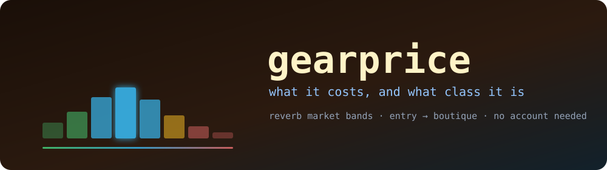

<div align="center">



<br>

[](https://www.rust-lang.org)
[](#platforms)
[](https://github.com/woksin/gearprice/actions/workflows/ci.yml)
[](https://github.com/woksin/gearprice/releases/latest)
[](#license)

**What guitar gear costs on Reverb right now — and what class of gear it actually is.**

</div>

---

## Two questions, two answers

Someone is asking $1,900 for a Les Paul Standard. Two different things are worth knowing,
and most tools answer neither cleanly.

**Is that a good price?** That is a question about this model's own market — what everyone
else is asking for the same guitar. gearprice answers it with a **band**.

**What kind of guitar is this, in money terms?** That is a question about the market
around it — where this model sits among every other electric guitar for sale. gearprice
answers it with a **class**.

A $2,300 Les Paul is expensive for a guitar and completely unremarkable for a Les Paul.
Those are different facts and you need both.

```console
$ gearprice price "Gibson Les Paul Standard 60s" --asking 1900
```

```
GEARPRICE  Gibson Les Paul Standard '60s (2019 - Present)
════════════════════════════════════════════════════════════════════════════════════════════
  Model                 Gibson · electric-guitars
                        https://reverb.com/p/gibson-les-paul-standard-60s-2019-present
  Market                174 used listings · USD · live Reverb listings — asking prices
  Method                read all 174 listings

  Class                 PRO  above the category median
                        64th percentile of 108,402 used Electric Guitars listings

  Asking $1,900         LOW  cheaper than three quarters of the market
                        $323 below the median asking price

Price bands  (what sellers are asking for this model right now)
  Band                          Range   Share  Meaning
  ──────────────────────────────────────────────────────────────────────────────────────────
  steal                  under $1,895     10%  below almost every other asking price
  low                 $1,895 – $2,050     15%  cheaper than three quarters of the market
  fair                $2,050 – $2,499     50%  in the middle half — the going rate
  high                $2,499 – $2,799     15%  dearer than three quarters of the market
  premium                 over $2,799     10%  above almost every other asking price

Distribution
           low          p25       median          p75         high         mean
        $1,599       $2,050       $2,223       $2,499       $7,636       $2,341

  Where the listings sit  (middle 90% — the tails are in low and high above)
       $1,800 – $1,946          20  ██████████████
       $1,946 – $2,092          20  ██████████████
       $2,092 – $2,239          42  ██████████████████████████████
       $2,239 – $2,385          24  █████████████████
       $2,385 – $2,531          28  ████████████████████
       $2,531 – $2,677           9  ██████
       $2,677 – $2,824           8  ██████
       $2,824 – $2,970           8  ██████
```

No account, no API key, no configuration. It reads Reverb's public marketplace.

---

## Asking prices, not sold prices

Every number gearprice reports comes from listings that are for sale **right now**. They
are what sellers are asking, not what anything sold for.

This is not a design choice. Reverb's public Price Guide endpoint — the one that carried
transaction history — was retired, and now answers every request, credentialled or not,
with `403 This endpoint is no longer publicly available`. Sold-price data is not
obtainable through the public API by any tool, gearprice included.

Asking prices are still the most useful signal available, and for a buyer they are the
one that matters: they are the prices you can actually act on today. But they run above
what gear changes hands for, and a model nobody is buying can hold a high asking price
indefinitely. gearprice says which it is showing on every report rather than letting the
distinction blur. Treat a band as *"how does this compare to what everyone else wants for
it"*, not *"what is it worth"*.

---

## Install

**Homebrew**

```bash
brew install woksin/gearprice/gearprice
```

**From a release** — download the binary for your platform from
[the latest release](https://github.com/woksin/gearprice/releases/latest) and put it on
your `PATH`. Every asset is listed in `SHA256SUMS` on the same release.

**From source** — needs Rust 1.88 or newer.

```bash
git clone https://github.com/woksin/gearprice
cd gearprice
./install.sh              # or: .\install.ps1 on Windows
```

Once installed, `gearprice update` upgrades in place, verifying the download against the
release's published checksums first.

---

## Commands

### `gearprice price` — what one model costs

The main one. Resolves what you typed to a model in Reverb's catalogue, measures its
market, and reports the bands and the class.

```bash
gearprice price "Fender American Professional II Stratocaster"
gearprice price "Boss DS-1" --asking 45          # is 45 a good price?
gearprice price "Les Paul Standard" --condition new
gearprice price "ES-335" --year-min 1960 --year-max 1969
gearprice price "Jazzmaster" --currency NOK --region NO
```

Resolving to a catalogue model is what makes the numbers mean anything. A text search for
`Boss DS-1` returns the pedal — and also a T-shirt, a knob set, a footswitch cover and a
page of service notes. Those land in the cheap end and turn "steal" into "not the thing
you were looking for". Pinning to the catalogue model searches the products Reverb has
identified as that piece of gear. Use `--raw` if you genuinely want the text search.

When more than one model matches, gearprice prices the closest and says so. Use
`gearprice models` to see the alternatives and `--model-id` to pick one exactly.

### `gearprice classes` — what a price class means in money

```console
$ gearprice classes electric-guitars
```

```
  Class                            Range   Share  Meaning
  ──────────────────────────────────────────────────────────────────────────────────────────
  entry                       under $600     20%  cheaper than four fifths of its category
  mid                      $600 – $1,495     30%  below the category median
  pro                    $1,495 – $3,800     30%  above the category median
  premium                $3,800 – $8,750     15%  dearer than four fifths of its category
  boutique                   over $8,750      5%  in the dearest twentieth of its category
```

Over 108,402 used listings. Same command works for any category:

```bash
gearprice classes effects-and-pedals
gearprice classes electric-guitars/semi-hollow
gearprice classes amps --condition new
```

### `gearprice models` — find the exact model

```bash
gearprice models "les paul standard"
```

```
  Model                                              Used   Used from    New    New from
  ──────────────────────────────────────────────────────────────────────────────────────────
  Gibson Les Paul Standard '60s (2019 - Present)      190      $1,750    241      $2,399
  Gibson Les Paul Standard '50s (2019 - Present)      183      $1,650    205      $2,299
  Gibson Les Paul Standard 1990 - 2001                135      $1,299      0           —
  Epiphone Les Paul Standard '60s (2020 - Present)     38        $250    103        $499
  Gibson Custom Shop '59 Les Paul Standard Reissu…     72      $3,999     99      $5,899
```

### `gearprice listings` — what is for sale, labelled

```bash
gearprice listings "Boss DS-1" --deals
```

Every listing carries the band it falls in, so `--deals` means "below the going rate for
this model" rather than "cheap-sounding".

### `gearprice categories` — the category tree

Slugs for `--category` and for `gearprice classes`. Either a top-level slug
(`electric-guitars`) or a subcategory (`solid-body`, or `electric-guitars/solid-body` when
a name appears under more than one parent).

---

## How the percentiles are worked out

This is the part worth explaining, because the obvious approach does not work.

Reverb will not hand over more than **2,500 listings** for any one search — `per_page`
caps at 50 and paging stops at page 50. A category like used electric guitars has over a
hundred thousand. You cannot download the market, so you cannot sort it and read off the
quartiles.

But every search reports a `total` that respects its filters — including price bounds.
So `count(price_max = P)` is the cumulative distribution function of the market evaluated
at P, and it costs one small request with no listings transferred at all.

That turns a percentile from a download into a search. The p-th percentile of n listings
is the lowest price P where `count(P) ≥ ceil(p·n)`, and an interpolating search finds it
in a logarithmic number of probes. gearprice takes a short log-spaced ladder first,
memoises every probe into one shared curve, and runs all the percentile searches
concurrently against it — counting a six-figure category takes Reverb well over a second
per request, so doing them in sequence is a minute of waiting and doing them together is
half of it. The curve they leave behind is the histogram, free.

The result is exact, not sampled: it is the same number a full enumeration would produce,
to the nearest whole currency unit, from about fifty requests on a market of any size.
The `classes` table above — five boundaries across 108,402 listings — is 58 requests and
about 30 seconds cold, instant thereafter from cache.

Below 600 listings gearprice reads the market instead, since at that size downloading is
cheaper than probing and gives more: the mean, the condition mix and the listings
themselves. Both paths report the same percentiles, and the report says which one ran.

---

## Where the numbers can mislead you

Stated plainly, because a price is only as good as what you know about it.

- **Asking, not sold.** Covered [above](#asking-prices-not-sold-prices). The single most
  important caveat.
- **A model is not a condition.** A `used` band spans mint to fair. A mint example at the
  top of the `fair` band may be the better buy than a beaten one at the bottom. Narrow it
  with `--condition excellent` when the market is big enough to support it.
- **Bands describe the listings, not the guitars.** A refinished, repaired or
  parts-assembled instrument sits in the same market as a clean one and drags the bottom
  down. The cheapest listing is very often cheap for a reason the price alone will not
  tell you.
- **Small markets are noisy.** Six listings do not have a meaningful 90th percentile. The
  report always shows how many listings it measured — read that number before the bands.
- **Currency conversion is Reverb's.** `--currency` asks Reverb to convert; gearprice does
  no conversion of its own and holds no exchange rates.
- **Live means live.** Two runs a week apart will differ, because the market did.

---

## Reference

### Global options

| Option | Default | |
|---|---|---|
| `-c`, `--currency CODE` | `USD` | Any currency Reverb converts to. `GEARPRICE_CURRENCY` |
| `--format table\|json\|csv` | `table` | |
| `--no-cache` | | Ignore cached responses |
| `--cache-ttl MINUTES` | `360` | How long a cached response stays good. `GEARPRICE_CACHE_TTL` |
| `--request-budget N` | `400` | Hard ceiling on API requests for one run |
| `--no-progress`, `--no-color` | | Also honours `NO_COLOR` and `GEARPRICE_NO_PROGRESS` |

### Filters

Available on `price` and `listings`.

| Option | |
|---|---|
| `--condition` | `all`, `used`, `new`, `b-stock`, `mint`, `mint-inventory`, `excellent`, `very-good`, `good`, `fair`, `poor`, `non-functioning`. Default `used` |
| `--category SLUG` | A slug from `gearprice categories`, or `root/leaf` |
| `--make NAME` | One brand |
| `--year-min`, `--year-max` | |
| `--region CODE` | Country code, e.g. `US`, `GB`, `NO` |

The condition list is closed on purpose. Reverb ignores a filter value it does not
recognise and answers `200` with the entire unfiltered set — ask it for `brand-new` and
you get every listing, new and used alike, with nothing to tell you the filter was
dropped. Only the values Reverb honours can be constructed, so that failure cannot happen.
The same applies to `--category`: an unknown slug is an error naming the nearest real one,
rather than a silent search of all 641,515 listings on the site.

As a second line of defence, when gearprice reads a market it checks the conditions that
came back against the one it asked for, and warns if they disagree — so if Reverb ever
changes its vocabulary under a released binary, the report says so instead of quietly
reporting the wrong population.

### Environment

| Variable | |
|---|---|
| `GEARPRICE_CURRENCY` | Default display currency |
| `GEARPRICE_CACHE_DIR` | Cache location. Defaults to `$XDG_CACHE_HOME/gearprice` or `~/.cache/gearprice` |
| `GEARPRICE_CACHE_TTL` | Default cache lifetime in minutes |
| `GEARPRICE_NO_PROGRESS` | Suppress the spinner |
| `GEARPRICE_API_ROOT` | Point at a different API root. For the test suite and for proxies |
| `NO_COLOR` | Suppress colour |

### Scripting

`--format json` gives a stable schema — the report gearprice owns, not Reverb's response
shape passed through.

```bash
gearprice price "Gibson Les Paul Standard 60s" --format json | jq '.class.segment'
# "pro"

gearprice price "Boss DS-1" --format json \
  | jq '.market.percentiles[] | select(.percentile == 50) | .price'
# 49.99

gearprice classes effects-and-pedals --format csv > pedal-classes.csv
```

Band names (`steal`, `low`, `fair`, `high`, `premium`) and class names (`entry`, `mid`,
`pro`, `premium`, `boutique`) are stable identifiers. Every report carries a `source`
field naming what the numbers are, and a `diagnostics` block with the request count, the
cache hits and any warnings.

CSV output prefixes any value a spreadsheet would evaluate as a formula with a quote —
listing titles are written by sellers, and a title beginning `=` should be a string, not
an execution.

---

## Being a good guest

gearprice uses Reverb's public read endpoints, which need no credentials. It tries to
deserve that.

Requests are paced, retried with backoff, and capped per run by `--request-budget`. A
`Retry-After` on a rate limit is obeyed. Every response is cached for six hours by
default, so repeat runs and adjusted flags are usually free — `gearprice cache` shows
what is held and `gearprice cache --clear` empties it.

---

## Platforms

macOS (Apple Silicon and Intel), Linux (x86-64 and arm64), Windows (x86-64 and x86).
Rust 1.88 or newer to build from source.

## License

MIT. See [LICENSE](LICENSE).

gearprice is not affiliated with, endorsed by, or connected to Reverb.com. It reads their
public API as any visitor would.
